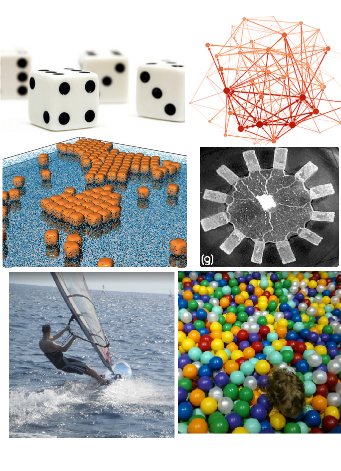
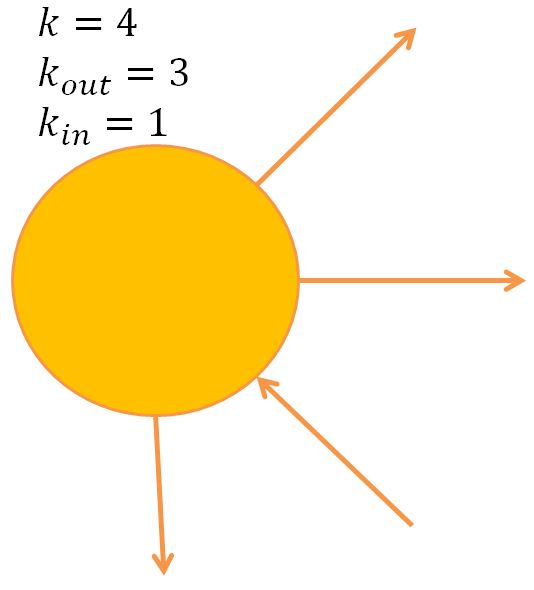

%Network Analysis in R
%Douglas Ashton - dashton@mango-solutions.com


# Workshop Aims

- Import/Export network data
- Visualising your network
- Descriptive stats
- Inference (statnet suite)

<br/><br/>
<center>Also available as a two-day training course! <a href="http://bit.ly/NetsWork01
">http://bit.ly/NetsWork01</a></center>


# About me

<table class="layout"><tr>
<td width=50%></td>
<td>
* Doug Ashton
* Physicist (statistical) for 10 years
    - Monte Carlo
    - Networks
* At Mango for 1.5 years
* Windsurfer

Twitter: <a href="https://twitter.com/dougashton">@dougashton</a>

Web: <a href="http://www.dougashton.net">www.dougashton.net</a>

GitHub: <a href="https://github.com/dougmet">dougmet</a>

</td></tr></table>

# Networks are everywhere

<div style="height:70%; text-align: center;">

</div>
# Networks in R

* R matrices (and sparse matrices in `Matrix`)
* `igraph` package
    - Gabor Csardi
* `statnet` package
    - University of Washington
    - suite of packages
    

# Representing Networks {.sepblank}

<!-- ################################################################
     ##                 Representing Networks                      ##
     ################################################################ -->


# Terminology

<table class="layout"><tr>
<td width=50%>
### Nodes and edges
 
</td><td>

### Directed

 
</td></tr></table>

# Matrix Representation

Code whether each possible edge exists or not.
$$
A_{ij} = \begin{cases} 0, & \mbox{no edge} \\ 1, & \mbox{edge exists} \end{cases}
$$

Example

<table class="layout"><tr>
<td width=50%>
$$
A=\left( \begin{array}{cccc} 0 & 0 & 1 & 1 \\ 1 & 0 & 0 & 0 \\ 
                      0 & 0 & 0 & 1 \\ 0 & 1 & 0 & 0 \end{array} \right)
$$
</td><td>
 
</td></tr></table>

# Matrices in R

<table class="layout"><tr>
<td width=50%>
### Create the matrix

```r
A <- rbind(c(0,1,0), c(1,0,1), c(1,0,0))
nodeNames <- c("A","B","C")
dimnames(A) <- list(nodeNames, nodeNames)
A
```

```
##   A B C
## A 0 1 0
## B 1 0 1
## C 1 0 0
```

Could also use sparse matrices from the `Matrix` package.

</td><td>
### Matrix operations

```r
# Matrix multiply
A %*% A 
```

```
##   A B C
## A 1 0 1
## B 1 1 0
## C 0 1 0
```
Gives the number of paths of length 2.


```r
# Matrix multiply
A %*% A %*% A %*% A 
```

```
##   A B C
## A 1 1 1
## B 2 1 1
## C 1 1 0
```
Gives the number of paths of length 4.
</td</tr></table>

# Edge List Representation

It is much more compact to just list the edges. We can use a two-column matrix

$$
E=\left[ \begin{array}{cc} A & B \\ B & A \\ B & C \\ C & A \end{array} \right]
$$

which is represented in R as


```r
el <- rbind(c("A","B"), c("B","A"), c("B","C"), c("C","A"))
el
```

```
##      [,1] [,2]
## [1,] "A"  "B" 
## [2,] "B"  "A" 
## [3,] "B"  "C" 
## [4,] "C"  "A"
```


# Representation in `igraph`

`igraph` has its own efficient data structures for storing networks. The simplest way to make one is `graph_from_literal`.
<br/>

<table class="layout"><tr>
<td width=50%>


```r
library(igraph)
g <- graph_from_literal(A--B, B-+C, C-+A)
```

`--` is both edges, `-+` is a directed edge.


```r
g
```

```
## IGRAPH DN-- 3 2 -- 
## + attr: name (v/c)
## + edges (vertex names):
## [1] B->C C->A
```
</td><td>
Output tells us it is

- Directed (D)
- Named (N)
- 3 Nodes and 4 Edges

And shows the edges (up to max number)

</td></tr></table>

# More ways to create `igraph` objects

<table class="layout"><tr>
<td width=50%>

### Edge lists


```r
g <- graph_from_edgelist(el, directed=TRUE)
```
</td><td>
### Adjacency matrices

```r
g <- graph_from_adjacency_matrix(A)
```

</td></tr>
<tr><td >
### Data frames


```r
df <- as.data.frame(el)
g <- graph_from_data_frame(df, directed=TRUE)
```
We'll come back to data frames.
</td><td></td>
</td></tr></table>


<br/><br/>
Trying searching for help on the `graph_from_` family of functions for more.

# Converting Back

From a graph object we can output just as we read in:

<table class="layout"><tr>
<td width=50%>
### Adjacency Matrix

```r
A <- as_adjacency_matrix(g, sparse = FALSE)
A
```

```
##   A B C
## A 0 1 0
## B 1 0 1
## C 1 0 0
```
</td><td>
### Edge List

```r
el <- as_edgelist(g)
el
```

```
##      [,1] [,2]
## [1,] "A"  "B" 
## [2,] "B"  "A" 
## [3,] "B"  "C" 
## [4,] "C"  "A"
```
</td></tr></table>


<!-- ################################################################
     ##                 Standard Structures                        ##
     ################################################################ -->

# Standard Structures {.sepblank}


# Standard Structures

`igraph` has a large number of built in functions for creating standard networks.


<table class="layout"><tr>
<td width=50%>
### Trees

```r
g <- make_tree(27, children=3)
```

 

</td><td>
### Complete Graphs (Cliques)

```r
g <- make_full_graph(n=6)
```

 

</td></tr></table>

# Standard Structures

<table class="layout"><tr>
<td width=50%>
### Lattices

```r
g <- make_lattice(dimvector = c(5,5),
                  circular = FALSE)
V(g)$label <- NA
```

 
</td><td>
### Stars

```r
g <- make_star(n=10,mode = "undirected")
```

 
</td></tr></table>

<center>Search help on the `make_` family of functions</center>

# Exercise

- Create a star network with 5 nodes
- Convert the network to an adjacency matrix


# Import/Export {.sepblank}


<!-- ################################################################
     ##              Import and Export                             ##
     ################################################################ -->

# Networks from Data Frames

Usually we'll read in edge lists as `data.frame` objects. The csv file `dolphin_edges.csv` contains the edge list of the undirected social network of 62 dolphins in a community living off Doubtful Sound, New Zealand*.


```r
dolphinEdges <- read.csv("data/dolphin_edges.csv")
head(dolphinEdges, n=4)
```

```
##   From      To
## 1  CCL  Double
## 2 DN16 Feather
## 3 DN21 Feather
## 4 Beak    Fish
```

Use the `graph_from_data_frame` function to read this format.


```r
dolphin <- graph_from_data_frame(dolphinEdges, directed=FALSE)
```

<small>*Data from: D. Lusseau, K. Schneider, O. J. Boisseau, P. Haase, E. Slooten, and S. M. Dawson, Behavioral Ecology and Sociobiology 54, 396-405 (2003)</small>


# Vertex Lists

It is also possible to load information about the vertices at the same time.


```r
dolphinVertices <- read.csv("data/dolphin_vertices.csv")
head(dolphinVertices, n=4)
```

```
##         Name Gender
## 1       Beak   Male
## 2 Beescratch   Male
## 3     Bumper   Male
## 4        CCL Female
```

And add this as the `vertices` argument to `graph_from_data_frame`.


```r
dolphin <- graph_from_data_frame(dolphinEdges, vertices=dolphinVertices,
                                 directed=FALSE)
```

Note: It's important that the first column of the vertex data frame is the names and they match the edge list perfectly.

# Exporting to a data.frame
To export an igraph object back to a data.frame we use the `as_data_frame` function. This
function can output the edge list, the vertex list or both depending on the what argument


```r
dolphinDFs <- as_data_frame(dolphin, what="both")
str(dolphinDFs) # Both data frames in a list
```

```
## List of 2
##  $ vertices:'data.frame':	62 obs. of  2 variables:
##   ..$ name  : chr [1:62] "Beak" "Beescratch" "Bumper" "CCL" ...
##   ..$ Gender: chr [1:62] "Male" "Male" "Male" "Female" ...
##  $ edges   :'data.frame':	159 obs. of  2 variables:
##   ..$ from: chr [1:159] "CCL" "DN16" "DN21" "Beak" ...
##   ..$ to  : chr [1:159] "Double" "Feather" "Feather" "Fish" ...
```

# Other formats

`igraph` allows import and export from a number of common formats. This is done using the `read_graph` and `write_graph` functions. A common open format is `graphml`.


```r
write_graph(dolphin, "dolphin.graphml", format="graphml")
```

See the table below for other common formats:

| Format | Description |
| ------ | ----------- |
| `edgelist` |  A simple text file with one edge per line |
| `pajek` | Pajek is a popular Windows program for network analysis |
| `gml` | Graph Modelling Language is a common text based open format |
| `graphml` | Graph Markup Language is an XML based open format |
| `dot` | Format used by GraphViz |

<b>Gephi:</b> To export to Gephi's native GEXF format use the `rgexf` package, available on CRAN, which
can convert directly from an igraph object.

# Exercise - Importing from csv

1. Load the dolphin data set into `igraph`. Remember
that the data is for an undirected network.

# Network Manipulation {.sepblank}

<!-- ################################################################
     ##                 Network Manipulation                       ##
     ################################################################ -->


<!-- - Attributes
     - Edge/Vertex selectors
     - Subgraphs
     - Adding/Deleting

     Don't cover contracting and merging.

     45 mins -->

# Attributes


All objects in `igraph`, vertices and edges, can have attributes. Even the graph itself:

Graph

```r
library(igraphdata)
data("USairports")
graph_attr(USairports)
```

```
## $name
## [1] "US airports"
```

Some have a special meaning, such as `name`, `weight` (for edges) and `type` (bi-partite graphs).

# Vertex Attributes

We can use the `_attr` functions to access attributes


```r
vertex_attr_names(USairports)
```

```
## [1] "name"     "City"     "Position"
```

```r
vertex_attr(USairports, "City")
```

```
## [1] "Bangor, ME"    "Boston, MA"    "Anchorage, AK" "New York, NY" 
## [5] "Las Vegas, NV" "Miami, FL"    
##  [ reached getOption("max.print") -- omitted 749 entries ]
```


# Edge Attributes


```r
edge_attr_names(USairports)
```

```
## [1] "Carrier"    "Departures" "Seats"      "Passengers" "Aircraft"  
## [6] "Distance"
```

```r
edge_attr(USairports, "Carrier")
```

```
## [1] "British Airways Plc"       "British Airways Plc"      
## [3] "British Airways Plc"       "China Airlines Ltd."      
## [5] "China Airlines Ltd."       "Korean Air Lines Co. Ltd."
##  [ reached getOption("max.print") -- omitted 23467 entries ]
```

The `weight` attribute is treated in a special way for edges and can affect the result of some calculations, such as path lengths and centrality measures.

# Sequences

The sequence functions: `V()` for vertices and `E()` for edges, allow selections and access to attributes. They return special `igraph.vs` and `igraph.es` objects that can be reused.


```r
V(USairports)[1:5] # Subset by index
```

```
## + 5/755 vertices, named:
## [1] BGR BOS ANC JFK LAS
```


```r
V(USairports)["JFK"] # Subset by name
```

```
## + 1/755 vertex, named:
## [1] JFK
```

Access all attributes of a vertex with double square brackets


```r
V(USairports)[["JFK"]] # All attributes
```

```
## + 1/755 vertex, named:
##   name         City         Position
## 4  JFK New York, NY N403823 W0734644
```

# Adding Attributes

The dollar notation allows us to manipulate attributes much like a `data.frame`.


```r
V(USairports)[1:5]$City # Access attributes
```

```
## [1] "Bangor, ME"    "Boston, MA"    "Anchorage, AK" "New York, NY" 
## [5] "Las Vegas, NV"
```


```r
# Add new attributes
V(USairports)$Group <- sample(c("A","B"), vcount(USairports), replace=TRUE)
V(USairports)[[1:5]] # Double square brackets give all attributes
```

```
## + 5/755 vertices, named:
##   name          City         Position Group
## 1  BGR    Bangor, ME N444827 W0684941     B
## 2  BOS    Boston, MA N422152 W0710019     A
## 3  ANC Anchorage, AK N611028 W1495947     A
## 4  JFK  New York, NY N403823 W0734644     B
## 5  LAS Las Vegas, NV N360449 W1150908     B
```

# Edge Selectors

We can also access edges between named vertices using the special `%--%` (undirected) and
`%->%` (directed) operators.


```r
E(USairports)["JFK" %--% "BOS"] # Edges in both directions
```

```
## + 26/23473 edges (vertex names):
##  [1] BOS->JFK BOS->JFK JFK->BOS JFK->BOS BOS->JFK JFK->BOS BOS->JFK
##  [8] JFK->BOS BOS->JFK BOS->JFK BOS->JFK BOS->JFK BOS->JFK JFK->BOS
## [15] JFK->BOS JFK->BOS JFK->BOS BOS->JFK JFK->BOS BOS->JFK BOS->JFK
## [22] JFK->BOS JFK->BOS BOS->JFK JFK->BOS BOS->JFK
```

All carriers from JFK to BOS.

```r
 unique(E(USairports)["JFK" %->% "BOS"]$Carrier) # Directed edges
```

```
## [1] "JetBlue Airways"              "Compass Airlines"            
## [3] "Pinnacle Airlines Inc."       "Comair Inc."                 
## [5] "Atlantic Southeast Airlines"  "American Eagle Airlines Inc."
## [7] "Chautauqua Airlines Inc."
```

# Edges Between Groups

The edge selectors can be between groups of vertices:


```r
# Grep the state code from the city
inCal <- grepl("CA$", V(USairports)$City)
inNy <- grepl("NY$", V(USairports)$City)

# Edges from CA to NY
E(USairports)[V(USairports)[inCal] %->% V(USairports)[inNy]]
```

```
## + 35/23473 edges (vertex names):
##  [1] LAX->JFK LAX->JFK LAX->JFK LAX->JFK SAN->JFK SFO->JFK SFO->JFK
##  [8] SFO->JFK BUR->JFK LAX->JFK LGB->JFK OAK->JFK SAN->JFK SFO->JFK
## [15] SJC->JFK SMF->JFK LAX->JFK LAX->JFK LAX->JFK SAN->JFK SAN->JFK
## [22] SFO->JFK SFO->JFK SNA->JFK LAX->ALB LAX->JFK LAX->JFK SFO->JFK
## [29] SFO->JFK SFO->JFK BUR->FRG LAX->JFK LAX->JFK SFO->JFK SFO->JFK
```

Returns all flights from California to New York (state).

# Exercise - Attributes

1. Using the igraph object created in the previous exercise, count the number of male and female dolphins in the pod.
2. Add a weight=1 attribute to every edge in the dolphin network. Verify that the igraph object is now a weighted network.

# Induced subgraph
To get a new graph containing the selected vertices we must also copy over all of the edges
between those vertices. This is done by the induced_subgraph function

```r
# inCal has the vertex ids we want
calAirports <- induced_subgraph(USairports, inCal)
calAirports
```

```
## IGRAPH DN-- 34 381 -- US airports
## + attr: name (g/c), name (v/c), City (v/c), Position (v/c), Group
## | (v/c), Carrier (e/c), Departures (e/n), Seats (e/n), Passengers
## | (e/n), Aircraft (e/n), Distance (e/n)
## + edges (vertex names):
##  [1] LAX->SFO LAX->SFO LAX->SFO LAX->SFO LAX->SFO LAX->SFO LAX->SFO
##  [8] LAX->SFO LAX->SFO LAX->SFO LAX->SFO LAX->SFO LAX->SFO LAX->SFO
## [15] LAX->SFO LAX->SFO LAX->SAN LAX->SAN LAX->SAN LAX->SAN LAX->SAN
## [22] LAX->SAN LAX->SAN LAX->SAN LAX->SAN LAX->SAN LAX->SAN LAX->SAN
## [29] LAX->SAN LAX->SAN LAX->SMF LAX->SMF LAX->SMF LAX->SMF LAX->SMF
## [36] LAX->SMF LAX->SMF LAX->SNA LAX->BUR LAX->OAK LAX->OAK LAX->OAK
## + ... omitted several edges
```

The subgraph.edges function does the same thing but selecting edges to keep (and their attached vertices).

# Neighbourhoods

A common task is to subset all of the neighbours of a particular vertex. To return all neigh-
bours within a distance, d, of a number of targets we can do


```r
d2Vertices <- ego(USairports, nodes = c("JFK","LAX"), order=2)
```

which returns a list containing the vertices within 2 of JFK and LAX. If we want the neighbourhood of a vertex as a new graph we can do

```r
JFKNet <- make_ego_graph(USairports, nodes = "JFK", order=2)[[1]]
# Returns a length 1 list
```


# Adding

The `edges` and `vertices` functions can be used to add edges


```r
# A directed completely empty graph
g <- make_empty_graph(n = 0, directed = TRUE)

g <- g + vertices(c("A","B","C"))
```

And edges


```r
g <- g + edges(c("A","C", "B","C")) # edge from A to C and "B" to "C"
```

# Deleting

For deletion it's easiest to use edge and vertex selectors


```r
g <- g - V(g)["A"] # Remove edge A
```

Note this will remove all attached edges. All edge and vertex subsetting can be used here.

# Exercise - Subgraphs

1. Find the edges in the USairports network that have a Distance>1500.
2. Use the edge indices to create the long haul (> 1500 miles) flights network.
3. How many airports can you get to from Oakland (OAK) with a single stop?


# Visualisation {.sepblank}


<!-- ################################################################
     ##              Visualisation                                 ##
     ################################################################ -->
# Plotting in `igraph`

`igraph` uses base R plotting methods. Plotting is done through the S3 generic plot function. To find specific help for this function try typing


```r
?plot.igraph
# Or
?igraph.plotting
```

# Default plot

The default settings for the network plot usually work well for small graphs.

<table class="layout">
<tr><td width=40%>

```r
# Make a ring with some cross connections
g <- make_ring(10, directed=TRUE, mutual=TRUE)
V(g)$name <- LETTERS[1:10]

g <- g + edges(9,5, 7,1, 1,5)
## plot(g)
```
</td><td>
 
</td></tr></table>

# Layouts

A layout is just a set of x and y coordinates. They can be specified manually but more often we will use one of the `layout_` functions.

<table class="layout">
<tr><td width=50%>
To enforce the ring structure we could do

```r
# Store coordinates for the layout in lo
lo <- layout_in_circle(g)
head(lo, n=4) # lo is a matrix of coordinates
```

```
##           [,1]      [,2]
## [1,]  1.000000 0.0000000
## [2,]  0.809017 0.5877853
## [3,]  0.309017 0.9510565
## [4,] -0.309017 0.9510565
```

</td><td>

```r
plot(g, layout=lo)
```

 
</td></tr></table>

See `?layout_` for a full list.

# More layouts

<table class="layout">
<tr><td width=50%>
For tree-like networks the `layout_as_tree` layout will try to organise vertices into levels.

```r
gTree <- make_tree(15)
plot(gTree, layout=layout_as_tree(gTree, root = 1))
```

 
</td><td>
Grid layout

```r
plot(g, layout=layout_on_grid(g))
```

 
</td></tr></table>

# Force Layouts

The most common layouts for medium or large graphs are force layouts. `igraph` has a number of these:

<table class="layout">
<tr><td width=50%>

| Function | Description |
| -------- | ----------- | 
| `layout_with_kk` | Kamada-Kawai layout algorithm. Edge weights correspond to length of springs  |
| `layout_with_fr` | Fruchterman-Reingold layout algorithm. Edge weights correspond to the strength of the springs |
| `layout_with_drl` | The Distributed Recursive (Graph) Layout (DrL) algorithm. Based on the VxOrd package from Sandia labs |

</td><td>


```r
plot(dolphin, layout=layout_with_fr(dolphin))
```

 

</td></tr></table>

# Vertex Properties

We can change various aspects of the vertex appearance. For example the shape:


```r
 # Plot vowels as rectangles
vowel <- V(g)$name %in% c("A","E","I","O","U") + 1 # gives 1 or 2
plot(g, layout=lo, vertex.shape=c("circle", "square")[vowel])
```

 

# Vertex Colours and Size

<table class="layout">
<tr><td width=50%>

```r
plot(g, layout=lo, vertex.color=c("tomato2", "royalblue")[vowel])
```

 
</td><td>

```r
plot(g, layout=lo, vertex.size=c(15,30)[vowel])
```

 
</td></tr></table>

# Properties Using Attributes

Any of the plotting properties can also be set as attributes of the vertices/edges.

<table class="layout">
<tr><td width=50%>

```r
V(g)$shape <- "circle" # Applies to all vertices
V(g)$size <- 15
V(g)$color <- "orange"

isVowel <- V(g)$name %in% c("A","E","I","O","U")

# Now overwrite the vowel nodes
V(g)[isVowel]$shape <- "square"
V(g)[isVowel]$color <- "royalblue"
V(g)[isVowel]$size <- 25

plot(g, layout=lo)
```
</td><td>
 
</td></tr></table>

# Edge Properties

A selection of edge properties we can change:

<table class="layout">
<tr><td width=50%>

```r
# Setting edge attributes
E(g)$width <- 1
E(g)[V(g)[isVowel] %--% V(g)[isVowel]]$width <- 4

## plot(g, layout=lo)
```
</td><td>
 
</td></tr></table>

# Curved Edges

<table class="layout">
<tr><td width=50%>

```r
# Only curve mutual edges
 plot(g, layout=lo, edge.curved=0.3*which_mutual(g))
```
</td><td>
 
</td></tr></table>

# Groupings

We can build some rich plots.
<table class="layout">
<tr><td width=50%>

```r
# Assign groups by index
groupList <- list(vowelGroup = which(isVowel),
                  constGroup1 = c(2,3,4),
                  constGroup2 = c(6,7,8))

# Alpha looks nice
groupColours <- c(rgb(0,0.3,1,0.5),
                  rgb(0.8,0.4,0.1,0.5),
                  rgb(0.8,0.4,0.1,0.5))

plot(g, layout=layout_with_fr, # Fruchterman-Reingold layout
  mark.groups=groupList, # Mark the groups
  mark.col= groupColours,
  mark.border = NA, # Remove the border (if desired)
  edge.curved=0.1*which_mutual(g))

 text(0.45,0.1,"Vowels", cex=1.5)
 text(0.5,0.9,"Consonant Group 1", cex=1.5)
 text(-0.8,-1,"Consonant Group 2", cex=1.5)
```
</td><td>
 
</td></tr></table>

# Descriptive Statistics {.sepblank}


<!-- ################################################################
     ##              Descriptive Statistics                        ##
     ################################################################ -->


# Background

Visualisations can be hard to interpret for large networks. Important features will often be impossible to see. Common features include:

1. Small worlds: As small-world networks grow the path length between vertices grows very slowly.

2. Hubs: Networks with hubs have a small number of vertices with a large number of connections.

3. Clustering: Your friends are often also friends with each other. In network terms this means that there are a lot of triangles.

We will look out how to measure and interpret these structural properties along with some more complex centrality measures for finding important vertices.

# Degree

<table class="layout">
<tr><td width="60%">
The degree, $k$, of a vertex is a count of the number edges attached to it. If the
network is directed then we refer to in-degree, $k_{in}$ for edges pointing into the vertex, and
out-degree, $k_{out}$,  for edges going out from the vertex.

In `igraph` we do


```r
 degDol <- degree(dolphin)
 head(degDol)
```

```
##       Beak Beescratch     Bumper        CCL      Cross       DN16 
##          6          8          4          3          1          4
```

A common task is to find the degree distribution


```r
hist(degree(dolphin))
```

For directed networks we can specify the type of degree with the `mode` argument taking `out`,
`in` or `total`.

</td><td>

</td></tr>
</table>

# Clustering

A simple local motif that we could look for is the triangle. This tells us whether your friends are likely to be friends, it also tells us about how often you’ll hear the same information
compared to hearing fresh information from outside your group. The relative frequency of
closed triangles is often known as *clustering*, or the *transitivity* of a network.


```r
g <- graph_from_literal(A--B, A--C, A--D, B--C, C--D, D--E)
```

<table class="layout">
<tr><td width="50%">
### Global Clustering

$$ C = \frac{3 ∗ \rm{Number\ of\ triangles}}{\rm{Number\ of\ connected\ triples}}$$


```r
 transitivity(g, type = "global")
```

```
## [1] 0.6
```

</td><td>
### Local Clustering

Fraction of connected triples through each vertex that are closed.


```r
 transitivity(g, type = "local")
```

```
## [1] 0.6666667 1.0000000 0.6666667 0.3333333       NaN
```
</td></tr></table>

# Paths

In graph theory a path is a sequence of vertices, each connected to the next with an edge. A geodesic, or shortest path, must not cross itself. In `igraph` we get shortest paths with:


```r
sp <- shortest_paths(dolphin, from="Beak", to="Whitetip") 
sp$vpath
```

```
## [[1]]
## + 4/62 vertices, named:
## [1] Beak     Grin     SN63     Whitetip
```

Other useful functions include: `distance_table`, `mean_distance`. The diameter of the network is the largest geodesic. This gives a good idea of the effective size of the network.


```r
diameter(dolphin)
```

```
## [1] 8
```

# Exercise - Structural Measures

For the dolphin network

1. Find the vertex with the highest degree, k.
2. Find the vertex with the highest local clustering coefficient.
3. Plot a histogram of the shortest path lengths between all vertices.

# Centrality Measures

Degree is the simplest centrality measure. Many others exist to try to assess which vertices are the most important in some way. The measure you choose depends on what function of the network you are interested in. Here we will cover some of the most popular measures.

# Betweeness Centrality

Betweeness centrality is based on the distances between vertices. It is (roughly) the number of geodesic paths that pass through any given node. Vertices with a high betweenness score will often act as bridging nodes between one or more communities.

<table class="layout"><tr>
<td width=50%>

```r
g <- make_full_graph(4) + vertex(1) + make_full_graph(4)
g <- g + edges(c(4,5,5,6))
V(g)$name <- LETTERS[1:9]
betweenness(g)
```

```
##  A  B  C  D  E  F  G  H  I 
##  0  0  0 15 16 15  0  0  0
```

Warning: Betweeness can be expensive to calculate. Try `estimate_betweeness` if `betweeness` is slow.

</td><td>
 
</td></tr></table>


# Eigenvector Centrality

The Eigenvector corresponding to the largest Eigenvalue of the adjacency matrix gives a high score to vertices that either have a lot of connections, or are connected to someone with a lot of connections.


```r
ec <- eigen_centrality(g)
ec$vector
```

```
##         A         B         C         D         E         F         G 
## 0.8493220 0.8493220 0.8493220 1.0000000 0.6294435 1.0000000 0.8493220 
##         H         I 
## 0.8493220 0.8493220
```

Warning: Eigenvector centrality may be used in directed networks but, in principle, there are left and right eigenvectors to choose from. Some caution is required here.

# PageRank Centrality

PageRank is the centrality measure used by Google to rank web pages. In fact ``Page'' refers to Larry Page, not a web page. 

It has a damping (`damping` in `igraph`) term, this imagines that you will click a few links but will eventually give up. Then there is another parameter (`personalized` in `igraph`) that represents the chance that at any moment the search is abandoned and reset to a random vertex.

In `igraph` PageRank is provided through `page_rank`.


```r
pr <- page_rank(g)
pr$vector
```

```
##          A          B          C          D          E          F 
## 0.10721963 0.10721963 0.10721963 0.14021259 0.07625702 0.14021259 
##          G          H          I 
## 0.10721963 0.10721963 0.10721963
```


# Community Detection

There isn't enough time in this workshop to cover community detection fully. `igraph` has a number functions, try typing `?cluster_fast_greedy` or `?communities` into the console.

<!-- # Community Detection {.sepblank} 

Abandon I think -- teaser...
-->

<!-- ################################################################
     ##              Community Detection                           ##
     ################################################################ -->


# Statistical Inference {.sepblank}


<!-- ################################################################
     ##              Statistical Inference                         ##
     ################################################################ -->

# Background

So far we have been describing the structural properties of a single network. In many cases the network data we have is only a sample of a larger system. Or perhaps a snapshot at one moment in time. To make meaningful statements in these cases we need the tools of statistical inference.

This section will involve making statistical models of networks based on the *random graph* family of network models.

# Statnet

`statnet` is a suite of network tools from a group of academics mostly at the University of
Washington (statnet.org). Each tool is a separate R package that is installed all in one go
with `statnet`.


```r
install.packages("statnet")
```

This includes the `network` package (core features), `sna` (social network analysis) and `ergm` (exponential random graphs). 

# Import to Statnet

The `statnet` suite is a complete set of network tools. However, it can be a little tricky to use compared to `igraph`. Here we will look at how to quickly get our data into `network` objects from files and converting from `igraph`.

<table class="layout"><tr><td>

```r
library(network)

el <- read.csv("data/dolphin_edges.csv")

# Read the edge list
dolphinNet <-network(el, matrix.type='edgelist',
                     ignore.eval=FALSE, directed=FALSE)

# Attach the vertex attributes
va <- read.csv("data/dolphin_vertices.csv",
               stringsAsFactors = FALSE)

 # it doesn't seem to like factors
dolphinNet%v%"Gender" <- va$Gender

# It also has a default plot method
## plot(dolphinNet)
```
</td><td>
 
</td></tr></table>

# Convert from `igraph`

The `intergraph` package is a useful shortcut to convert the objects from one package to the other.


```r
library(intergraph)

# statnet -> igraph
dolphinIgraph <- asIgraph(dolphinNet, vnames="vertex.names")

 # igraph -> statnet
data("karate")
karateNet <- asNetwork(karate)
```

# Random Graphs

A random graph is the simplest of the graph models. Every edge exists with probability, $p$, and we only fix the average number of edges (the density). We can generate random graphs with:

<table class="layout"><tr><td>

```r
set.seed(10)
g <- sample_gnp(10, p=0.2)
```
</td><td>
 
</td></tr></table>
# Exponential Random Graph Models (ERGMs)

An exponential random graph extends the simple random graph by increasing the probability of other properties and network motifs, not just the density. We can fit parameters to each motif in a similar way to terms in a GLM. First the simple case:

On the left hand side of the formula is the network, on the right are the terms we wish to include. The `edges` term fits a parameter related to $p$ from the previous slide.

<table class="layout"><tr><td>

```r
library(ergm)
fit <- ergm(dolphinNet ~ edges)
```

```
## Evaluating log-likelihood at the estimate.
```

```r
fit
```

```
## 
## MLE Coefficients:
##  edges  
## -2.388
```
</td><td>

```r
# Check it worked
pFit <- exp(fit$coef)/(1+exp(fit$coef))
p <- network.density(dolphinNet)

p
```

```
## [1] 0.0840825
```

```r
pFit
```

```
##     edges 
## 0.0840825
```
</td></tr></table>

# Group Membership
The first question we might wish to ask is are connections affected by group membership?
In the case of the dolphin network we know the gender of most of the dolphins.


```r
fitGender <- ergm(dolphinNet ~ edges + nodematch("Gender"))
```

```
## Evaluating log-likelihood at the estimate.
```

Are dolphins of the same gender more likely to be connected?


```r
summary(fitGender)
```


# Group Membership

<small>

```
## 
## ==========================
## Summary of model fit
## ==========================
## 
## Formula:   dolphinNet ~ edges + nodematch("Gender")
## <environment: 0x00000000195f0498>
## 
## Iterations:  6 out of 20 
## 
## Monte Carlo MLE Results:
##                  Estimate Std. Error MCMC % p-value    
## edges             -2.9024     0.1385      0  <1e-04 ***
## nodematch.Gender   0.9538     0.1737      0  <1e-04 ***
## ---
## Signif. codes:  0 '***' 0.001 '**' 0.01 '*' 0.05 '.' 0.1 ' ' 1
## 
##      Null Deviance: 2621  on 1891  degrees of freedom
##  Residual Deviance: 1060  on 1889  degrees of freedom
##  
## AIC: 1064    BIC: 1075    (Smaller is better.)
```
</small>
Yes!

# Other Model Terms

| Name | Description |
| ---- | ----------- |
| `edges` | Fits the total number of edges |
| `nodematch` | Fits the propensity for inter-group edges |
| `nodecov` | Nodal covariates, numeric variables that might influence connection |
| `triangles` | Total number of triangles, fits more clustered networks. Can have trouble fitting. |
| `gwesp` | Can be more stable than `triangles` |
| `degree` | Degree distribution |

See `?"ergm-terms"` for a full list of terms.

Other ergm functionality:

- Constraints may also be added to the model `?"ergm-constraints"`.
- Simulate from a model fit with the `simulate` function.
- Check goodness of fit with the `gof` function.

# Simulation example


```r
dolphinSim <- simulate(fitGender)

op <- par(mfrow=c(1,2), mar=c(0,0,1,0))
plot(dolphinNet, vertex.col=c("pink","blue", "white")[factor(dolphinNet%v%"Gender")],
     main="Real Network")
plot(dolphinSim, vertex.col=c("pink","blue", "white")[factor(dolphinNet%v%"Gender")],
     main="Simulated Network")
par(op)
```

<table class="layout"><tr><td width="50%">

 
</td><td>
The simulated network misses the community structure but does recreate density and inter-gender connectivity.
</td></tr></table>
# Goodness of Fit

The goodness of fit function, `gof` will simulated many networks and calculate summary statistics to see how close the model networks are to your original model. This is very useful to assess the quality of your model. Here we fit degree well (left) but clustering and geodesic distance poorly.


```r
gofGender <- gof(fitGender)
plot(gofGender)
```

 


# What Next?

- Stay around for the evening event!
- Full two day network analysis course - <a href="http://www.mango-solutions.com/wp/products-services/r-services/r-training/">www.mango-solutions.com</a>. Email <a href="mailto:training@mango-solutions.com">training@mango-solutions.com</a>
- Other courses: Introduction to R, Shiny apps, Package development, Visualisation, Python and more.
- EARL (13th-15th September 2016)

# Follow Mango

<center>
<table class="layout" style="width: 50%;"><tr><td>

</td><td>
<a href="https://twitter.com/mangothecat">@mangothecat</a>

<a href="https://twitter.com/earlconf">@earlconf</a>

</td></tr><tr><td>

</td><td>
<a href="https://github.com/mangothecat">mangothecat</a>
</td></tr></table>
</center>

Contact me: <a href="mailto:dashton@mango-solutions.com">dashton@mango-solutions.com</a>
